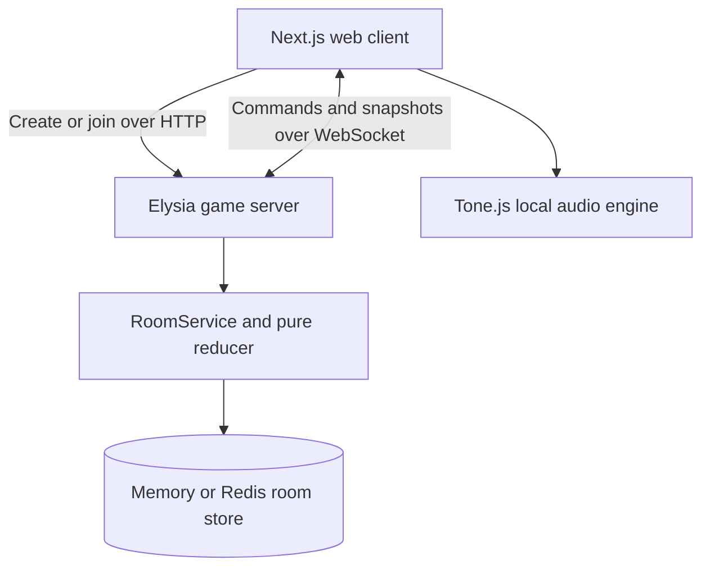

# MusicPhone

MusicPhone is a real-time multiplayer music game: **Gartic Phone, but with looped songs**.

Each player receives a musical kit, starts one song, and then rotates through every other
player's song. On each turn they add a new layer—drums, bass, lead, keys, pad, or another
selected role—without necessarily seeing the full arrangement. When every rotation is
complete, the room reveals each finished song one layer at a time.

The project is designed as a game first, not a full digital audio workstation. Musical
choices are intentionally constrained so a group can create something coherent quickly,
even when some players have little production experience.

## Core game loop

1. A host creates a room and shares its short code.
2. Between 2 and 8 players join with nicknames.
3. The host chooses the loop length, round duration, available kits, and how much previous
   work players can see.
4. The server assigns every player a different kit and gives every song a random tempo,
   root note, and scale.
5. During round `r`, player `i` edits song `(i + r) % playerCount`.
6. Players compose in a piano roll or drum grid, preview the loop, and submit their layer.
7. The round advances when all connected players submit or when the timer expires. Drafts
   are autosaved and are still committed if time runs out.
8. After one round per player, every song contains one layer from every participant.
9. The group enters a synchronized reveal, then can replay the songs or export the session
   as JSON.

The assigned kit stays with a player for the entire game. Because every player visits every
song exactly once, each final arrangement receives every assigned role exactly once.

## Features

- Anonymous rooms with short shareable codes
- 2–8 players with live presence and host controls
- Piano-roll and drum-grid editors at 16th-note resolution
- Eight selectable roles: drums, lead, synth, bass, pluck, pad, keys, and stab
- Twelve synthesized instruments and three drum kits
- Per-song BPM, key, and scale chosen by the server
- Scale-locked composition with an optional chromatic unlock
- Three context modes: previous layer, full arrangement, or blind
- Configurable 2–8 bar loops and 1–5 minute rounds in the current interface
- One server-controlled sound reroll per player and round
- Debounced draft autosave and automatic WebSocket reconnection
- Server-authoritative timers, assignments, validation, and reveal state
- Progressive group reveal with per-client layer muting
- JSON export of completed songs
- Optional Redis persistence across server restarts
- Reduced-motion support and a hardware-inspired interface

MusicPhone currently targets tablets and computers. Screens at or below `720px` wide, or
`480px` high, receive a notice instead of the editor.

## Architecture



The network carries musical data and game state, **not audio**. Every browser receives note
layers and renders them locally through Tone.js. This keeps the protocol small and avoids
streaming or synchronizing audio files.

### Web client

The Next.js client owns presentation, local editing state, reconnection, and audio playback.
Zustand provides a single client-side game store. HTTP is used only to create or join a room;
all later gameplay uses one typed WebSocket protocol.

The first round opens with a synchronized kit wheel and a slot-machine reveal for BPM, key,
and scale. Players then edit with either:

- `PianoRollEditor` for pitched roles; or
- `DrumGridEditor` for the drums role.

Tone.js instruments and drum voices are created lazily after the browser's audio context has
been unlocked by a user gesture. Tone's global transport has one tracked owner, so starting a
new preview cleanly stops the previous one.

### Game server

The Bun/Elysia server is authoritative. It owns room phases, role assignments, random song
parameters, round deadlines, note validation, readiness, and reveal permissions.

Every state change follows the same path:

1. Parse an inbound WebSocket message.
2. Attach the player identity from the socket, never from the message body.
3. Load the room and pass a command to the pure reducer.
4. Save the new room with an optimistic version check.
5. Run the reducer's effects: snapshots, direct messages, broadcasts, timers, or cleanup.

Commands for the same room are serialized by `RoomService`. The storage layer also uses
compare-and-set versions, preventing concurrent writes from silently overwriting each other.

### Shared domain package

`@musicphone/shared` is consumed directly as TypeScript source by both applications. It is the
single contract for:

- room, player, melody, segment, note, and configuration types;
- client/server WebSocket messages;
- runtime input sanitization;
- scales and MIDI helpers;
- roles and game-mode behavior.

Keeping game rules and protocol types shared prevents the client and server from drifting.

### Persistence and recovery

Without `REDIS_URL`, the server uses an in-memory store suitable for development. With Redis,
the complete serializable room—including current drafts and absolute round deadlines—survives
a server restart.

On startup, the server clears stale connection flags and restores timers. Reconnecting players
receive their own saved draft, sound, reroll count, role, song parameters, and permitted context
layers. Private in-progress turns are never included in general room snapshots.

Redis rooms have a rolling four-hour TTL. An empty room is normally removed one minute after
the last player disconnects, while lobby disconnects have a five-second grace period for reloads
and transient network changes.

## Repository structure

```text
music-phone/
├── apps/
│   ├── web/                 Next.js UI, Zustand store, editors, and Tone.js audio
│   └── server/              Elysia HTTP/WebSocket server and game runtime
├── packages/
│   └── shared/              Domain types, messages, validation, modes, and music helpers
├── docker-compose.local.yml Production-like local stack with web, server, and Redis
├── DEPLOYMENT.md            Dokploy/VPS deployment guide
├── package.json             Bun workspace scripts
└── vitest.config.ts         Shared, server, and framework-free web test projects
```

Important server boundaries:

```text
apps/server/src/
├── game/
│   ├── create.ts            Pure room creation and joining
│   ├── commands.ts          All room-changing intents
│   ├── reducer.ts           Pure game state machine
│   ├── effects.ts           Side effects requested by the reducer
│   └── serialize.ts         Per-player sanitized snapshots
├── runtime/
│   ├── room-service.ts      Load → reduce → save → effects orchestration
│   ├── store/               Memory and Redis RoomStore implementations
│   ├── scheduler/           Round, grace, and cleanup timers
│   └── connections.ts       Live WebSocket delivery bus
└── ws/handlers.ts           Untrusted payload parsing and command mapping
```

## Technology

| Area | Technology |
| --- | --- |
| Runtime and package manager | Bun 1.3+ |
| Web application | Next.js 15, React 19, TypeScript |
| Client state | Zustand 5 |
| Audio | Tone.js 15 |
| Animation | Motion 12 |
| Server | Elysia 1.1 on Bun |
| Typed HTTP client | Eden Treaty |
| Persistence | Redis through ioredis, with an in-memory fallback |
| Validation | Dependency-free shared runtime parsers plus mode-specific note validation |
| Tests | Vitest 3 |
| Quality | TypeScript strict mode, ESLint 9, Prettier 3 |
| Deployment | Docker, Docker Compose, and Dokploy |

## Local development

### Requirements

- [Bun](https://bun.sh/) `>= 1.3.0`
- A modern browser with Web Audio support
- Redis only if restart persistence is needed locally

### Start the applications

```bash
bun install
```

Run the server and web app in separate terminals:

```bash
bun run dev:server
```

```bash
bun run dev:web
```

Open [http://localhost:3000](http://localhost:3000). In development, the client defaults to
`http://localhost:3001` when `NEXT_PUBLIC_SERVER_URL` is not set.

Local development works without Redis, but rooms will disappear whenever the server restarts.

### Run the production containers locally

```bash
docker compose -f docker-compose.local.yml up --build
```

This starts the web app, server, and Redis, then exposes MusicPhone at
[http://localhost:3000](http://localhost:3000).

## Environment variables

| Variable | Application | Required | Purpose |
| --- | --- | --- | --- |
| `PORT` | Server | No | HTTP/WebSocket port; defaults to `3001` |
| `WEB_ORIGIN` | Server | Production | Exact allowed web origin, without a trailing slash; defaults to `*` |
| `REDIS_URL` | Server | Production | `redis://` or `rediss://` connection URL; memory is used when absent |
| `NEXT_PUBLIC_SERVER_URL` | Web | Production | Public HTTP URL of the game server, inlined during `next build` |

The WebSocket URL is derived automatically from `NEXT_PUBLIC_SERVER_URL`: `https://` becomes
`wss://`. Because this value is embedded in the client bundle, changing it requires rebuilding
the web image rather than restarting it.

## HTTP and WebSocket surface

| Method | Route | Purpose |
| --- | --- | --- |
| `GET` | `/health` | Server health check |
| `POST` | `/rooms` | Create a room and return its code and host player ID |
| `POST` | `/rooms/:code/join` | Join a lobby and return the player's ID |
| `WS` | `/ws?code=…&playerId=…` | Realtime room connection and reconnect identity |

Client WebSocket intents cover configuration, game start, autosave, submission, readiness,
sound rerolls, reveal control, and leaving. Server messages provide per-player snapshots, round
assignments, restored turn state, turn updates, round/game announcements, and errors. The exact
discriminated unions live in `packages/shared/src/messages.ts`.

## Data model

| Type | Meaning |
| --- | --- |
| `Note` | MIDI pitch or drum-lane index plus step-based start and duration |
| `Segment` | One player's complete loop layer, including role, sound, notes, and author |
| `Melody` | One song with server-rolled musical parameters and stacked segments |
| `TurnState` | A player's private draft, submitted notes, sound, and reroll budget |
| `Room` | Complete authoritative and persistable game state |
| `RoomSnapshot` | Sanitized per-player state safe to send to a client |

All note positions use grid steps. One measure contains 16 steps, and a full loop contains
`stepsPerMeasure * barsPerSong` steps. Pitched notes use MIDI numbers from C2 (`36`) through C7
(`96`); drum notes use stable lane indices.

## Project commands

| Command | Purpose |
| --- | --- |
| `bun run dev:web` | Start the Next.js development server |
| `bun run dev:server` | Start the Bun server in watch mode |
| `bun run build` | Build every workspace |
| `bun run typecheck` | Type-check every workspace |
| `bun run lint` | Run ESLint |
| `bun run lint:fix` | Apply safe ESLint fixes |
| `bun run test` | Run all Vitest projects once |
| `bun run test:watch` | Run Vitest in watch mode |
| `bun run format` | Format the repository with Prettier |
| `bun run format:check` | Check formatting without modifying files |
| `bun run verify` | Run type-checking, linting, and tests |

## Extending MusicPhone

### Add a pitched instrument

1. Add an `InstrumentDef` under `apps/web/src/lib/audio/instruments/`.
2. Register it in `apps/web/src/lib/audio/instruments/index.ts`.
3. Add its ID to a role's `instruments` pool in `packages/shared/src/modes/layers.ts`.

Instrument instances are lazy and cached. An unknown ID safely falls back to the default lead
sound, but only IDs allowed by the player's assigned role are accepted by the server.

### Add a drum sound or kit

Add a drum voice file and register the kit mapping in
`apps/web/src/lib/audio/drums/kits.ts`. Drum-lane order is persisted as note data, so existing
lanes must not be reordered; append new lanes instead.

### Add a role

Add a `Role` entry to `LAYER_ROLES` and include its ID in `DEFAULT_SELECTED_ROLES`. A role selects
an editor, color, sound pool, default octave focus, and scale-lock behavior. The server validates
turns based on the editor type, while the web client resolves sound IDs to Tone.js definitions.

### Add a game mode

Implement the `GameMode` contract under `packages/shared/src/modes/`, extend `GameModeId`, and
register the implementation in `MODES`. A mode controls round count, song rotation, visible
context, and turn normalization while remaining independent of sockets, React, and Tone.js.

## Validation, privacy, and operational limits

- The server validates all untrusted messages and clamps room configuration.
- Player identity comes from the established socket query, not a client message body.
- Full melodies are withheld until the results phase to preserve the telephone-style surprise.
- Drafts are private and only restored to their owner.
- Browser origins are checked during WebSocket upgrades; CORS alone does not protect them.
- Per-IP room creation/join limits and per-socket message limits reduce unauthenticated abuse.
- MusicPhone has no accounts: a room-specific player ID in `localStorage` acts as the reconnect
  token for an ephemeral session.
- Run one game-server instance today. Room storage already supports optimistic concurrency, but
  live connections and timers are process-local.
- Finished sessions export structured JSON only; audio and MIDI export are not currently built in.

## Deployment

Production uses separate web and server images plus Redis. Build both Dockerfiles from the
repository root because each application consumes the shared workspace package. Deploy the
server before the web app, then build the web image with the public server URL.

See [DEPLOYMENT.md](./DEPLOYMENT.md) for the complete Dokploy setup, environment placement,
health checks, Redis configuration, smoke test, and operating notes.
